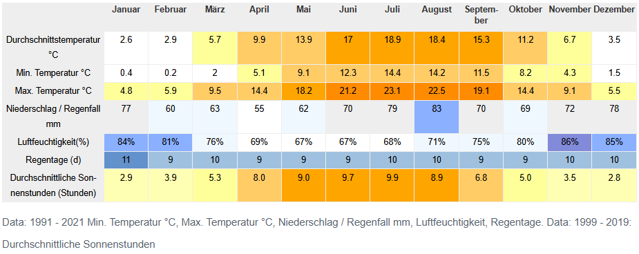

# Wir haben unsere Auswertung mit R gemacht

## Was ist R?

-   Open-Source Programmiersprache speziell für Statistik und Datenanalyse
-   Bringt tausende Pakete für Auswertung, Visualisierung und Reproduzierbarkeit mit
-   Funktioniert interaktiv (Konsole/RStudio) und in Skripten für reproduzierbare Workflows
-   Läuft auf allen gängigen Betriebssystemen und ist frei verfügbar

## Warum R?

-   Saubere Trennung von Code, Daten und Ergebnis: Analysen bleiben nachvollziehbar
-   Starke Visualisierung (z.B. `ggplot2`) für schnelle Diagramme unserer Messdaten
-   Große Community und Dokumentation; Probleme sind meist schon gelöst
-   Passt gut zu Quarto: Text, Code und Grafiken in einer präsentation kombinierbar

## Daten einlesen - Steinfurter Straße

Als erstes Laden wir die Daten von der Steinfurter Straße:

<details>

<summary>Code</summary>

```{r}
#| echo: true 
#| message: true

# Header aus erster Zeile auslesen
csv_headers = read.csv2(file = "data/data-as-csv/metMastSteinfurterStr.csv", 
                        header = FALSE, nrows = 1, as.is = TRUE)

# Daten ab Zeile 6 einlesen mit den Header-Namen
data <- read.csv2(
  "data/data-as-csv/metMastSteinfurterStr.csv",
  skip = 5,
  header = FALSE,
  dec = ","
)
colnames(data) <- csv_headers

# Index für Plots erstellen
data$index <- 1:nrow(data)
```

</details>

```{css, echo=FALSE}
/* Schriftgröße VOR der DT-Berechnung setzen */
.dataTables_wrapper {
  font-size: 11px !important;
}
.dataTables_wrapper table thead th {
  font-size: 10px !important;
  padding: 3px 5px !important;
  max-width: 120px;
  overflow: hidden;
  text-overflow: ellipsis;
}
.dataTables_wrapper table tbody td {
  font-size: 11px !important;
  padding: 2px 4px !important;
}
```

```{r}
DT::datatable(
  head(data, 200),
  options = list(
    scrollY = "350px",
    scrollX = TRUE,
    pageLength = 50,
    searching = FALSE,
    paging = FALSE,
    info = FALSE,
    autoWidth = FALSE,
    columnDefs = list(
      list(width = "90px", targets = 0),  # Zeitstempel etwas breiter
      list(width = "60px", targets = "_all")  # Alle anderen schmal
    ),
    initComplete = htmlwidgets::JS(
      "function(settings, json) {",
      "  this.api().columns.adjust();",
      "}"
    )
  ),
  class = "compact cell-border stripe",
  style = "bootstrap"
)
```

## Lufttemperatur - Zeitreihe

```{r}
# Zeitstempel konvertieren
data$Zeit <- as.POSIXct(data$Zeitstempel, format = "%d.%m.%Y %H:%M")

# Monat extrahieren
data$Monat <- format(data$Zeit, "%m")

# Summary für gesamten Zeitraum
summary(data$`Durschnittl. Lufttemperatur [°C]`)
```

```{r}
#| echo: false
#| fig-width: 10
#| fig-height: 5

library(ggplot2)

ggplot(data, aes(x = Zeit, y = `Durschnittl. Lufttemperatur [°C]`)) +
  geom_line(color = "#E74C3C", linewidth = 1) +
  labs(title = "Durchschnittliche Lufttemperatur",
       subtitle = "Messzeitraum: 18.11.2025 - 09.12.2025",
       x = "Datum",
       y = "Temperatur [°C]") +
  theme_minimal() +
  theme(plot.title = element_text(size = 16, face = "bold"),
        plot.subtitle = element_text(size = 12))
```

## Tagesgang: Daily Min/Mean/Max + Amplitude

```{r}
#| echo: false
#| fig-width: 12
#| fig-height: 5.5

library(dplyr)

daily <- data %>%
  mutate(Datum = as.Date(Zeit)) %>%
  group_by(Datum) %>%
  summarise(
    min = min(`Durschnittl. Lufttemperatur [°C]`, na.rm = TRUE),
    max = max(`Durschnittl. Lufttemperatur [°C]`, na.rm = TRUE),
    mean = mean(`Durschnittl. Lufttemperatur [°C]`, na.rm = TRUE),
    amplitude = max - min,
    .groups = "drop"
  )

ggplot(daily, aes(x = Datum)) +
  geom_col(aes(y = amplitude, fill = "Amplitude"), alpha = 0.7) +
  geom_linerange(aes(ymin = min, ymax = max, color = "Min–Max"), linewidth = 0.9) +
  geom_point(aes(y = mean, color = "Mittelwert"), size = 2.2) +
  labs(
    title = "Tagesgang kompakt",
    subtitle = "Min/Mean/Max und Tagesamplitude",
    x = "Datum",
    y = "Temperatur [°C]"
  ) +
  scale_fill_manual(name = "Legende", values = c("Amplitude" = "#F4A261")) +
  scale_color_manual(name = "Legende", values = c("Min–Max" = "#2A9D8F", "Mittelwert" = "#264653")) +
  theme_minimal() +
  theme(
    plot.title = element_text(size = 16, face = "bold"),
    plot.subtitle = element_text(size = 12)
  )
```

## Luftfeuchtigkeit - Zeitreihe

```{r}
# Summary für gesamten Zeitraum
summary(data$`Durschnittl. rel. Luftfeuchtigkeit [%]`)
```

```{r}
#| echo: false
#| fig-width: 10
#| fig-height: 5

library(ggplot2)

ggplot(data, aes(x = Zeit, y = `Durschnittl. rel. Luftfeuchtigkeit [%]`)) +
  geom_line(color = "#3498DB", linewidth = 1) +
  labs(title = "Durchschnittliche relative Luftfeuchtigkeit",
       subtitle = "Messzeitraum: 18.11.2025 - 09.12.2025",
       x = "Datum",
       y = "Relative Luftfeuchtigkeit [%]") +
  theme_minimal() +
  theme(plot.title = element_text(size = 16, face = "bold"),
        plot.subtitle = element_text(size = 12))
```

## Lufttemperatur und Luftfeuchtigkeit

```{r}
#| echo: false
#| fig-width: 10
#| fig-height: 6

library(ggplot2)

# Primäre und sekundäre Achse
ggplot(data, aes(x = Zeit)) +
  geom_line(aes(y = `Durschnittl. Lufttemperatur [°C]`, 
                color = "Temperatur"), linewidth = 1) +
  geom_line(aes(y = `Durschnittl. rel. Luftfeuchtigkeit [%]` / 10, 
                color = "Luftfeuchtigkeit"), linewidth = 1) +
  scale_y_continuous(
    name = "Temperatur [°C]",
    sec.axis = sec_axis(~.*10, name = "Relative Luftfeuchtigkeit [%]")
  ) +
  scale_color_manual(values = c("Temperatur" = "#E74C3C", 
                                  "Luftfeuchtigkeit" = "#3498DB")) +
  labs(title = "Temperatur und Luftfeuchtigkeit im Verlauf",
       subtitle = "Steinfurter Straße",
       x = "Datum",
       color = "Messwert") +
  theme_minimal() +
  theme(legend.position = "bottom",
        plot.title = element_text(size = 16, face = "bold"),
        axis.title.y.left = element_text(color = "#E74C3C"),
        axis.title.y.right = element_text(color = "#3498DB"))
```

## Temperatur- und Feuchteänderung: Stündlich aggregiert

```{r}
#| echo: false
#| fig-width: 10
#| fig-height: 6

library(dplyr)
library(lubridate)
library(ggplot2)

# Stündliche Aggregation
data_hourly <- data |>
  mutate(Hour = floor_date(Zeit, "hour")) |>
  group_by(Hour) |>
  summarise(
    temp_mean = mean(`Durschnittl. Lufttemperatur [°C]`, na.rm = TRUE),
    rh_mean = mean(`Durschnittl. rel. Luftfeuchtigkeit [%]`, na.rm = TRUE),
    .groups = "drop"
  )

# Stündliche Änderungen
data_hourly$delta_temp_h <- c(NA, diff(data_hourly$temp_mean))
data_hourly$delta_rh_h   <- c(NA, diff(data_hourly$rh_mean))

# Korrelation der stündlichen Steigungen
r_val_h <- cor(data_hourly$delta_temp_h, data_hourly$delta_rh_h, use = "complete.obs")
r_sq_h  <- r_val_h^2

ggplot(data_hourly, aes(x = delta_temp_h, y = delta_rh_h)) +
  geom_point(alpha = 0.4, size = 2, color = "#2A9D8F") +
  geom_smooth(method = "lm", se = TRUE, color = "#E76F51", linewidth = 1.2) +
  geom_hline(yintercept = 0, color = "gray50", linetype = 2) +
  geom_vline(xintercept = 0, color = "gray50", linetype = 2) +
  labs(
    title = "Stündliche Änderungen: Temperatur vs. rel. Luftfeuchte",
    subtitle = paste0("Antiproportionaler Zusammenhang: R² = ", sprintf("%.3f", r_sq_h)),
    x = "Δ Temperatur (°C pro Stunde)",
    y = "Δ rel. Luftfeuchte (% pro Stunde)"
  ) +
  theme_minimal() +
  theme(
    plot.title = element_text(size = 16, face = "bold"),
    plot.subtitle = element_text(size = 12)
  )
```

## Stündliche Änderungen: Ohne Nullwerte (ΔRH = 0)

```{r}
#| echo: false
#| fig-width: 10
#| fig-height: 6

# Filtern: Nur Punkte mit ΔRH ≠ 0
data_hourly_filtered <- data_hourly |>
  filter(delta_rh_h != 0, !is.na(delta_rh_h), !is.na(delta_temp_h))

# Korrelation der gefilterten Steigungen
r_val_filt <- cor(data_hourly_filtered$delta_temp_h, data_hourly_filtered$delta_rh_h, use = "complete.obs")
r_sq_filt  <- r_val_filt^2

ggplot(data_hourly_filtered, aes(x = delta_temp_h, y = delta_rh_h)) +
  geom_point(alpha = 0.4, size = 2, color = "#2A9D8F") +
  geom_smooth(method = "lm", se = TRUE, color = "#E76F51", linewidth = 1.2) +
  geom_hline(yintercept = 0, color = "gray50", linetype = 2) +
  geom_vline(xintercept = 0, color = "gray50", linetype = 2) +
  labs(
    title = "Stündliche Änderungen (gefiltert: ΔRH ≠ 0)",
    subtitle = paste0("Antiproportionaler Zusammenhang: R² = ", sprintf("%.3f", r_sq_filt)),
    x = "Δ Temperatur (°C pro Stunde)",
    y = "Δ rel. Luftfeuchte (% pro Stunde)"
  ) +
  theme_minimal() +
  theme(
    plot.title = element_text(size = 16, face = "bold"),
    plot.subtitle = element_text(size = 12)
  )
```
## Vergleich - Temperatur

{width=100%}

::: {.columns}

::: {.column width="50%"}

```{r}
# Summary für November
cat("November 2025:\n")
summary(data$`Durschnittl. Lufttemperatur [°C]`[data$Monat == "11"])
```

:::

::: {.column width="50%"}
```{r}
# Summary für Dezember
cat("\nDezember 2025:\n")
summary(data$`Durschnittl. Lufttemperatur [°C]`[data$Monat == "12"])
```
:::

:::

## Vergleich - Luftfeuchtigkeit

{width=100%}

::: {.columns}

::: {.column width="50%"}

```{r}
cat("November 2025:\n")
summary(data$`Durschnittl. rel. Luftfeuchtigkeit [%]`[data$Monat == "11"])
```

:::

::: {.column width="50%"}

```{r}
cat("\nDezember 2025:\n")
summary(data$`Durschnittl. rel. Luftfeuchtigkeit [%]`[data$Monat == "12"])
```

:::

:::


## Was ist die absolute Luftfeuchtigkeit?

Die **absolute Luftfeuchtigkeit** gibt an, wie viel Wasserdampf tatsächlich in der Luft enthalten ist.

::: {.incremental}
- **Definition:** Masse des Wasserdampfs pro Volumeneinheit Luft (in g·m⁻³ oder kg·m⁻³)
- **Unabhängig von der Temperatur:** Der Wert ändert sich nur, wenn Wasser verdunstet oder kondensiert
- **Unterschied zur relativen Feuchte:** Die relative Feuchte (%) zeigt, wie "voll" die Luft ist – die absolute zeigt die tatsächliche Wassermenge
:::

## Absolute Feuchte - Theorie {.smaller}

::::: columns
::: {.column width="50%"}
**Formel:** $$a = \frac{e \cdot 100}{R_w \cdot T}$$

| Symbol | Bedeutung        | Einheit        |
|--------|------------------|----------------|
| $a$    | Absolute Feuchte | kg·m⁻³         |
| $e$    | Dampfdruck       | hPa            |
| $R_w$  | Gaskonstante H₂O | 461,5 J/(kg·K) |
| $T$    | Lufttemperatur   | K              |
:::

::: {.column width="50%"}
**Dampfdruck aus rel. Feuchte:** $$e = \frac{RH}{100} \cdot e_s$$

**Sättigungsdampfdruck (Magnus):** $$e_s = 6{,}112 \cdot e^{\frac{17{,}67 \cdot T_C}{T_C + 243{,}5}}$$
:::
:::::

## Absolute Feuchte - Berechnung

<details>

<summary>Code</summary>

```{r}
#| echo: true
#| warning: false

# Spezifische Gaskonstante für Wasserdampf [J/(kg·K)]
Rw <- 461.5

# Temperatur und rel. Feuchte aus den korrekten Spalten
temperatur <- data$`Durschnittl. Lufttemperatur [°C]`
rel_feuchte <- data$`Durschnittl. rel. Luftfeuchtigkeit [%]`

# Temperatur in Kelvin umrechnen
T_kelvin <- temperatur + 273.15

# Sättigungsdampfdruck nach Magnus-Formel [hPa]
es <- 6.112 * exp((17.67 * temperatur) / (temperatur + 243.5))

# Aktueller Dampfdruck [hPa]
e <- (rel_feuchte / 100) * es

# Absolute Feuchte [kg·m⁻³]
# Formel: a = (e * 100) / (Rw * T)
# Faktor 100: Umrechnung hPa -> Pa
data$absolute_feuchte <- (e * 100) / (Rw * T_kelvin)

# Zeitstempel konvertieren
data$Zeit <- as.POSIXct(data$Zeitstempel, format = "%d.%m.%Y %H:%M")
```

</details>

```{r}
#| echo: true
summary(data$absolute_feuchte)
```

## Absolute Feuchte - Zeitreihe

<details>

<summary>Code</summary>

```{r}
#| echo: true
#| fig-width: 10
#| fig-height: 5.5

library(ggplot2)

ggplot(data, aes(x = Zeit, y = absolute_feuchte)) +
  geom_line(color = "#00BFC4", linewidth = 0.5) +
  labs(
    title = "Absolute Feuchte - Steinfurter Straße",
    subtitle = "Zeitraum: 18.11.2025 - 09.12.2025",
    x = "Datum",
    y = expression("Absolute Feuchte [kg m"^{-3}*"]"),
  ) +
  theme_minimal(base_size = 14) +
  theme(
    plot.title = element_text(face = "bold", size = 16),
    plot.subtitle = element_text(color = "gray60"),
    axis.title = element_text(face = "bold"),
    panel.grid.minor = element_blank()
  ) +
  scale_x_datetime(date_labels = "%d.%m", date_breaks = "3 days")
```

</details>

```{r}
#| echo: false
#| fig-width: 10
#| fig-height: 5.5

library(ggplot2)

ggplot(data, aes(x = Zeit, y = absolute_feuchte)) +
  geom_line(color = "#00BFC4", linewidth = 0.5) +
  labs(
    title = "Absolute Feuchte - Steinfurter Straße",
    subtitle = "Zeitraum: 18.11.2025 - 09.12.2025",
    x = "Datum",
    y = expression("Absolute Feuchte [kg m"^{-3}*"]"),
  ) +
  theme_minimal(base_size = 14) +
  theme(
    plot.title = element_text(face = "bold", size = 16),
    plot.subtitle = element_text(color = "gray60"),
    axis.title = element_text(face = "bold"),
    panel.grid.minor = element_blank()
  ) +
  scale_x_datetime(date_labels = "%d.%m", date_breaks = "3 days")
```

## Absolute vs. Relative Luftfeuchtigkeit
<details>
<summary>Code</summary>
```{r}
#| echo: true
#| fig-width: 10
#| fig-height: 5.5
library(ggplot2)

ggplot(data, aes(x = Zeit)) +
  geom_line(aes(y = `Durschnittl. rel. Luftfeuchtigkeit [%]`, 
                color = "Relative Luftfeuchtigkeit"), linewidth = 0.8) +
  geom_line(aes(y = absolute_feuchte * 10000, 
                color = "Absolute Luftfeuchtigkeit"), linewidth = 0.8) +
  scale_y_continuous(
    name = "Relative Luftfeuchtigkeit [%]",
    sec.axis = sec_axis(~./10000, name = expression("Absolute Luftfeuchtigkeit [kg m"^{-3}*"]"))
  ) +
  scale_color_manual(values = c("Relative Luftfeuchtigkeit" = "#3498DB", 
                                "Absolute Luftfeuchtigkeit" = "#00BFC4")) +
  labs(title = "Vergleich: Absolute und Relative Luftfeuchtigkeit",
       subtitle = "Steinfurter Straße | Messzeitraum: 18.11.2025 - 09.12.2025",
       x = "Datum",
       color = "Messgröße") +
  theme_minimal(base_size = 14) +
  theme(
    legend.position = "bottom",
    plot.title = element_text(face = "bold", size = 16),
    plot.subtitle = element_text(color = "gray60"),
    axis.title.y.left = element_text(color = "#3498DB", face = "bold"),
    axis.title.y.right = element_text(color = "#00BFC4", face = "bold"),
    axis.text.y.left = element_text(color = "#3498DB"),
    axis.text.y.right = element_text(color = "#00BFC4"),
    panel.grid.minor = element_blank()
  ) +
  scale_x_datetime(date_labels = "%d.%m", date_breaks = "3 days")
```
</details>

```{r}
#| echo: false
#| fig-width: 10
#| fig-height: 5.5

library(ggplot2)

ggplot(data, aes(x = Zeit)) +
  geom_line(aes(y = `Durschnittl. rel. Luftfeuchtigkeit [%]`, 
                color = "Relative Luftfeuchtigkeit"), linewidth = 0.8) +
  geom_line(aes(y = absolute_feuchte * 10000, 
                color = "Absolute Luftfeuchtigkeit"), linewidth = 0.8) +
  scale_y_continuous(
    name = "Relative Luftfeuchtigkeit [%]",
    sec.axis = sec_axis(~./10000, name = expression("Absolute Luftfeuchtigkeit [kg m"^{-3}*"]"))
  ) +
  scale_color_manual(values = c("Relative Luftfeuchtigkeit" = "#3498DB", 
                                "Absolute Luftfeuchtigkeit" = "#00BFC4")) +
  labs(title = "Vergleich: Absolute und Relative Luftfeuchtigkeit",
       subtitle = "Steinfurter Straße | Messzeitraum: 18.11.2025 - 09.12.2025",
       x = "Datum",
       color = "Messgröße") +
  theme_minimal(base_size = 14) +
  theme(
    legend.position = "bottom",
    plot.title = element_text(face = "bold", size = 16),
    plot.subtitle = element_text(color = "gray60"),
    axis.title.y.left = element_text(color = "#3498DB", face = "bold"),
    axis.title.y.right = element_text(color = "#00BFC4", face = "bold"),
    axis.text.y.left = element_text(color = "#3498DB"),
    axis.text.y.right = element_text(color = "#00BFC4"),
    panel.grid.minor = element_blank()
  ) +
  scale_x_datetime(date_labels = "%d.%m", date_breaks = "3 days")
```

## Was ist Autokorrelation?

**Autokorrelation** misst, wie stark ein Messwert mit früheren Messwerten zusammenhängt.

-   Wenn die Temperatur **jetzt** hoch ist, ist sie wahrscheinlich auch in 10 Minuten noch hoch
-   Je weiter wir in die Vergangenheit schauen, desto schwächer wird dieser Zusammenhang
-   **Hohe Autokorrelation** = starke Ähnlichkeit zwischen Werten mit bestimmtem Zeitabstand

## Was ist Autokorrelation?

**Mathematisch:** $$
\text{ACF}(k) = \frac{\text{Kovarianz}(X_t, X_{t-k})}{\text{Varianz}(X_t)}
$$

wobei $k$ die Anzahl der Zeitschritte (Lag) zurück ist.

## Autokorrelation berechnen in R

```{r}
#| echo: true
#| eval: false
# acf() berechnet die Autokorrelation für verschiedene Lags
# lag.max = 432 entspricht 3 Tagen (432 × 10min = 4320min = 72h)
acf(data$`Durschnittl. Lufttemperatur [°C]`, lag.max = 432)
```

-   **Lag 0**: Korrelation mit sich selbst (immer 1.0)
-   **Lag 144**: Korrelation mit dem Wert von vor 24h (144 × 10min = 1440min = 24h)
-   **Lag 288**: Korrelation mit dem Wert von vor 48h

Die blauen gestrichelten Linien zeigen die **Signifikanzgrenze** – Werte darüber sind statistisch bedeutsam.

## Autokorrelation der Temperatur

```{r}
#| echo: False
#| fig-width: 14
#| fig-height: 6

# ACF-Daten berechnen
temp_acf <- acf(data$`Durschnittl. Lufttemperatur [°C]`, 
                lag.max = 432, 
                plot = FALSE)

# Plot erstellen
plot(temp_acf, 
     main = "Autokorrelation der Lufttemperatur (10-Minuten-Daten)",
     xlab = "Lag (10-Minuten-Schritte)",
     ylab = "ACF",
     ci.col = "blue")

# 24h-Markierungen hinzufügen (alle 144 Lags = 24h)
abline(v = c(144, 288, 432), col = "red", lty = 2, lwd = 2)

# Beschriftung für die 24h-Marken
text(x = 144, y = 0.9, labels = "24h", col = "darkred", pos = 3, cex = 1.2, font = 2)
text(x = 288, y = 0.9, labels = "48h", col = "darkred", pos = 3, cex = 1.2, font = 2)
text(x = 432, y = 0.9, labels = "72h", col = "darkred", pos = 3, cex = 1.2, font = 2)
```

**Beobachtung:** Deutliche Spitzen alle 24 Stunden → Täglicher Temperaturzyklus!

## Interpretation: Tagesverlauf in den Daten

-   **Hohe Autokorrelation bei Lag 144 (24h):** Die Temperatur jetzt ist stark korreliert mit der Temperatur zur gleichen Uhrzeit gestern
-   **Wellenmuster:** Die Autokorrelation oszilliert mit einer Periode von \~144 Lags
-   **Ursache:** Der tägliche Sonnenzyklus (Tag/Nacht) erzeugt eine periodische Temperaturschwankung

→ Um **langfristige Trends** zu erkennen, müssen wir diesen **Tagesverlauf herausrechnen**!

## Periodische Komponente (Tagesverlauf) rausrechnen

Um langfristigere Trends in der Temperatur besser zu erkennen, können wir die Temperaturschwankungen durch den Tagesverlauf herausrechnen.

**Idee:** Der Tagesverlauf ist **periodisch** – wir können ihn als **Sinusfunktion** modellieren und optimieren!

$$T(t) = T_0 + A \cdot \sin\left(\frac{2\pi \cdot t}{P} + \phi\right)$$

wobei $T_0$ = Basispegel, $A$ = Amplitude, $P$ = Periode (1440 min = 24h), $\phi$ = Phasenverschiebung, $t$ = Zeit

```{r}
#| echo: False
library(lubridate)

# Zeitstempel in echte Datumszeit umwandeln
data$Zeitstempel <- dmy_hm(data$Zeitstempel)

# Zeit in Minuten seit Anfang (für Sinus-Fit)
data$t_min <- as.numeric(difftime(data$Zeitstempel, data$Zeitstempel[1], units = "mins"))

# Temperatur als numeric
data$temp_num <- as.numeric(gsub(",", ".", data$`Durschnittl. Lufttemperatur [°C]`))

# Sinus-Modell fitten mit nls (nonlinear least squares)
fit <- nls(temp_num ~ T0 + A * sin(2*pi*t_min/P + phi),
           data = data,
           start = list(T0 = mean(data$temp_num, na.rm=T), 
                       A = (max(data$temp_num, na.rm=T) - min(data$temp_num, na.rm=T))/2,
                       P = 1440, 
                       phi = 0),
           na.action = na.exclude)

# Fitted Tagesverlauf extrahieren
data$Tagesverlauf_fit <- predict(fit)

# Bereinigte Daten: Tagesverlauf abziehen
data$Temp_bereinigt <- data$temp_num - data$Tagesverlauf_fit

# Optimierte Parameter anzeigen
summary(fit)
```

## Vergleich: Modell vs. Rohdaten und bereinigte Daten

```{r}
#| echo: false
#| fig-width: 14
#| fig-height: 6

par(mfrow = c(2, 1), mar = c(4, 4, 3, 1))

# 1) Rohdaten mit modelliertem Tagesverlauf (Sinus) überlagert
plot(data$Zeitstempel, 
  data$temp_num,
  type = "l", 
  main = "Rohdaten vs. modellierter Tagesverlauf (Sinus-Fit)",
  xlab = "Zeit",
  ylab = "Temperatur [°C]",
  col = "gray30",
  lwd = 1)
lines(data$Zeitstempel, data$Tagesverlauf_fit, col = "red", lwd = 2)
legend("topleft", 
    legend = c("Rohdaten", "Sinus-Modell"),
    col = c("gray30", "red"),
    lty = 1, lwd = c(1,2), bty = "n")

# 2) Bereinigte Daten (Rohdaten minus modellierter Tagesverlauf)
plot(data$Zeitstempel, 
  data$Temp_bereinigt,
  type = "l", 
  main = "Bereinigte Daten: Temperaturanomalie (Tagesverlauf herausgerechnet)",
  xlab = "Zeit",
  ylab = "Abweichung vom Tagesverlauf [°C]",
  col = "darkred",
  lwd = 1)
abline(h = 0, col = "gray", lty = 2)

par(mfrow = c(1, 1))
```

## Autokorrelation: Rohdaten vs. bereinigte Daten

```{r}
#| echo: false
#| fig-width: 18
#| fig-height: 5

par(mfrow = c(1, 2), mar = c(4, 4, 3, 1))

# ACF Rohdaten
acf_raw <- acf(na.omit(data$temp_num), lag.max = 432, plot = FALSE)
plot(acf_raw, 
  main = "ACF Rohdaten (10-Min)",
  xlab = "Lag (10-Min-Schritte)",
  ylab = "ACF",
  ci.col = "blue")
abline(v = c(144, 288, 432), col = "red", lty = 2, lwd = 2)
text(x = 144, y = 0.9, labels = "24h", col = "darkred", pos = 3, cex = 1.2, font = 2)
text(x = 288, y = 0.9, labels = "48h", col = "darkred", pos = 3, cex = 1.2, font = 2)
text(x = 432, y = 0.9, labels = "72h", col = "darkred", pos = 3, cex = 1.2, font = 2)

# ACF bereinigte Daten
acf_clean <- acf(na.omit(data$Temp_bereinigt), lag.max = 432, plot = FALSE)
plot(acf_clean, 
  main = "ACF bereinigt (Anomalie)",
  xlab = "Lag (10-Min-Schritte)",
  ylab = "ACF",
  ci.col = "blue")
abline(v = c(144, 288, 432), col = "red", lty = 2, lwd = 2)
text(x = 144, y = 0.9, labels = "24h", col = "darkred", pos = 3, cex = 1.2, font = 2)
text(x = 288, y = 0.9, labels = "48h", col = "darkred", pos = 3, cex = 1.2, font = 2)
text(x = 432, y = 0.9, labels = "72h", col = "darkred", pos = 3, cex = 1.2, font = 2)

par(mfrow = c(1, 1))
```

-   Links: starke Peaks bei 24h/48h/72h in den Rohdaten
-   Rechts: Peaks sind deutlich abgeschwächt → Tageszyklus erfolgreich entfernt

# Viele Dank für eure Aufmerksamkeit
